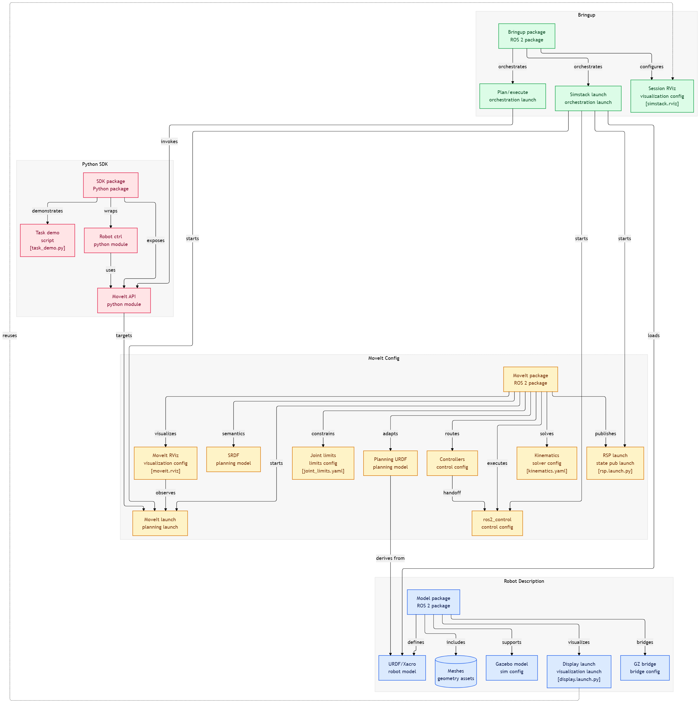

# ROS 2 Robot Arm Simulation & Control Stack

A modular ROS 2-based robotic arm ecosystem integrating **robot description, Gazebo simulation, MoveIt motion planning, bringup orchestration, and a Python SDK**.


---

## Overview

This project is organized as a clean robotics pipeline:

1. **Robot Description** defines the mechanical model, geometry, and simulation assets.
2. **MoveIt Config** adds planning, kinematics, joint limits, and controller wiring.
3. **Bringup** launches the full simulation and execution stack.
4. **Python SDK** provides a simple API for scripts and task demos.

<!-- VISUAL 1: full architecture diagram -->
### Architecture at a Glance



---

## What This Project Contains

### Robot Description
- URDF/Xacro robot model
- Meshes and geometry assets
- Gazebo simulation config
- ROS ↔ Gazebo bridge config
- Visualization launch file

<!-- VISUAL 2: RViz robot model screenshot -->
#### Insert here
**Needed:** clean RViz screenshot of the robot loaded from the description package.  
**Best caption:** *Robot model rendered from the description package.*

---

### MoveIt Configuration
- Planning URDF
- SRDF semantics
- Kinematics solver config
- Joint limits
- MoveIt controllers
- ros2_control config
- RViz planning config
- MoveIt launch files

<!-- VISUAL 3: MoveIt planning scene screenshot -->
#### Insert here
**Needed:** screenshot of MoveIt running in RViz with planning scene visible.  
**Best caption:** *MoveIt planning scene and motion goal execution.*

---

### Bringup Package
- Full simulation launch
- Plan-and-execute launch
- Session RViz config

<!-- VISUAL 4: terminal + RViz + Gazebo combo -->
#### Insert here
**Needed:** one wide screenshot showing terminal logs, Gazebo, and RViz together.  
**Best caption:** *End-to-end system bringup in one session.*

---

### Python SDK
- MoveIt API wrapper
- Robot controller wrapper
- Task demo script

<!-- VISUAL 5: terminal output or script demo -->
#### Insert here
**Needed:** terminal screenshot or code snippet showing a Python command controlling the robot.  
**Best caption:** *Python SDK driving motion commands.*

---

## Repository Layout

```text
src/
├── rv5as_so-assy_model_asm_description/
│   ├── urdf/
│   ├── meshes/
│   ├── config/
│   └── launch/
├── rv5as_moveit_config_new/
│   ├── config/
│   └── launch/
├── my_robot_bringup/
│   ├── launch/
│   └── config/
└── my_robot_sdk/
    └── my_robot_sdk/
```

---

## How the Stack Connects

The packages are intentionally separated so each layer can be tested independently before the full integration.

Your provided architecture shows how the model package feeds the MoveIt config, how bringup orchestrates the runtime, and how the SDK talks to the planning/execution layer. fileciteturn0file0

<!-- VISUAL 6: simplified flow diagram -->
### Insert here
**Needed:** a simplified horizontal flow graphic: `SDK → Bringup → MoveIt → Controllers → Robot`.  
*Command flow from Python to physical or simulated motion.*

---

## Getting Started

```bash
colcon build
source install/setup.bash
```

### Launch Simulation
```bash
ros2 launch my_robot_bringup simstack_bringup.launch.py
```

### Run the Demo
```bash
ros2 run my_robot_sdk task_demo.py
```

---

## Recommended Screenshots and Media

Use these assets to make the README feel complete:

- **Top banner image** — a wide hero shot or rendered robot image
- **Architecture diagram** — the package flow visual
- **RViz screenshot** — planning scene and robot state
- **Gazebo screenshot** — the simulated robot in motion
- **Execution GIF** — moving from pose A to pose B
- **Terminal strip** — launch logs and success output

<!-- VISUAL 7: demo GIF -->
#### Insert here
**Needed:** short GIF of the robot executing a planned motion.  
**Best caption:** *Motion demo from a scripted task.*

---

## Suggested Animated Demo Ideas

- A short GIF showing **launch → plan → execute**
- A split-screen clip of **RViz planning on one side and Gazebo motion on the other**
- A looped GIF of the robot returning to a **home pose**
- A before/after comparison of **planning goal set vs. trajectory executed**

---

## Design Notes

- Keep the README visually spaced out.
- Use one strong diagram near the top.
- Add screenshots only where they explain the layer being described.
- Keep code blocks short and practical.
- Prefer captions over long paragraphs under images.

---

## Contributing

Pull requests and improvements are welcome. The project is structured so each subsystem can be extended independently.

---

## License

Add your chosen license here.
