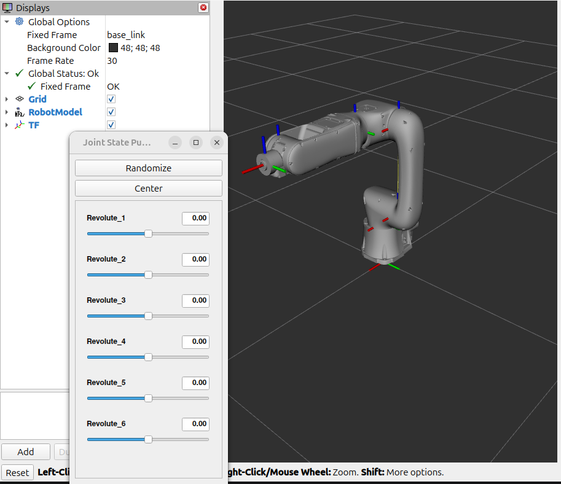
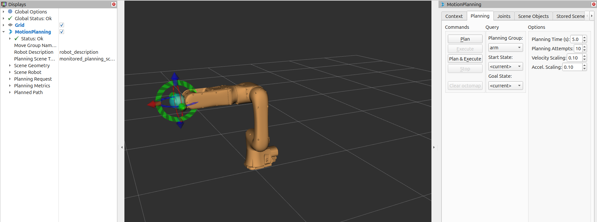
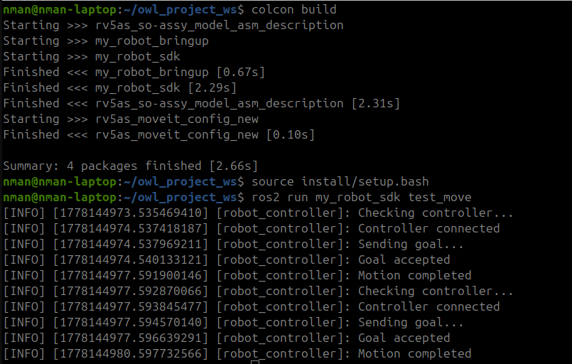
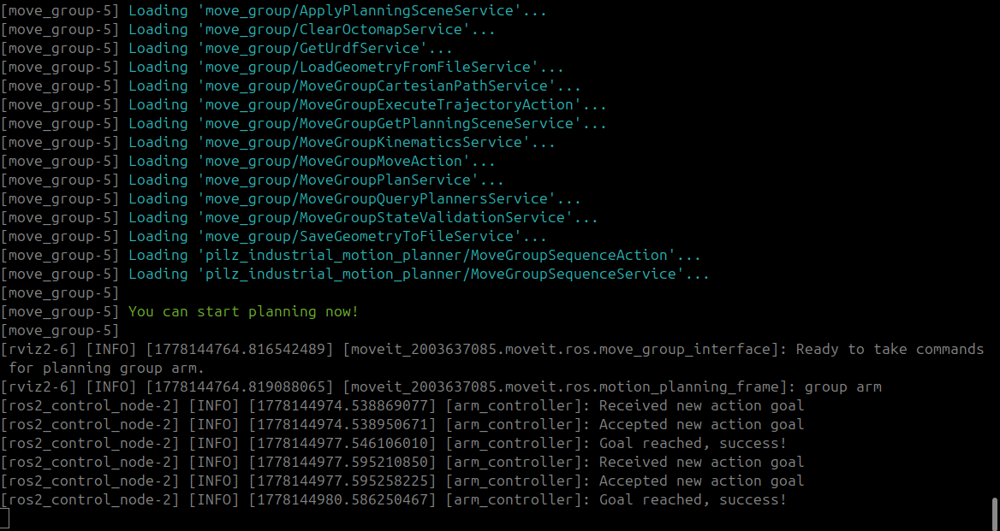
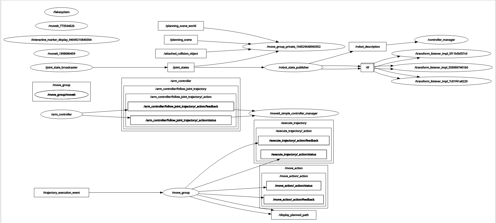

# ROS 2 Robot Arm Simulation & Control Stack

A modular ROS 2-based robotic arm ecosystem integrating **robot description, Gazebo simulation, MoveIt motion planning, bringup orchestration, and a Python SDK**.


---

## Overview

This project is organized as a clean robotics pipeline:

1. **Robot Description** defines the mechanical model, geometry, and simulation assets.
2. **MoveIt Config** adds planning, kinematics, joint limits, and controller wiring.
3. **Bringup** launches the full simulation and execution stack.
4. **Python SDK** provides a simple API for scripts and task demos.

<!-- VISUAL 1: full architecture diagram -->
### Architecture at a Glance


---

## What This Project Contains

### Robot Description
- URDF/Xacro robot model
- Meshes and geometry assets
- Gazebo simulation config
- ROS ↔ Gazebo bridge config
- Visualization launch file

<!-- VISUAL 2: RViz robot model screenshot -->

 
 *Robot model rendered from the description package.*

---

### MoveIt Configuration
- Planning URDF
- SRDF semantics
- Kinematics solver config
- Joint limits
- MoveIt controllers
- ros2_control config
- RViz planning config
- MoveIt launch files

<!-- VISUAL 3: MoveIt planning scene screenshot -->


*MoveIt planning scene and motion goal execution.*

---

### Bringup Package
- Full simulation launch
- Plan-and-execute launch
- Session RViz config

<!-- VISUAL 4: terminal + RViz + Gazebo combo -->


*End-to-end system bringup in one session.*

---

### Python SDK
- MoveIt API wrapper
- Robot controller wrapper
- Task demo script

<!-- VISUAL 5: terminal output or script demo -->



*Python SDK driving motion commands.*

---

## Repository Layout

```text
src/
├── rv5as_so-assy_model_asm_description/
│   ├── urdf/
│   ├── meshes/
│   ├── config/
│   └── launch/
├── rv5as_moveit_config_new/
│   ├── config/
│   └── launch/
├── my_robot_bringup/
│   ├── launch/
│   └── config/
└── my_robot_sdk/
    └── my_robot_sdk/
```

---

## How the Stack Connects

The packages are intentionally separated so each layer can be tested independently before the full integration.

The provided architecture shows how the model package feeds the MoveIt config, how bringup orchestrates the runtime, and how the SDK talks to the planning/execution layer.

<!-- VISUAL 6: simplified flow diagram -->
### Insert here
`SDK → Bringup → MoveIt → Controllers → Robot`
RQT Graph
 
*Command flow from Python to physical or simulated motion.*

---

## Getting Started

```bash
colcon build
source install/setup.bash
```

### Launch Simulation
```bash
ros2 launch my_robot_bringup simstack_bringup.launch.py
```

### Run the Demo
```bash
ros2 run my_robot_sdk task_demo.py
```

## Contributing

Pull requests and improvements are welcome. The project is structured so each subsystem can be extended independently.

---

## License

Add your chosen license here.
